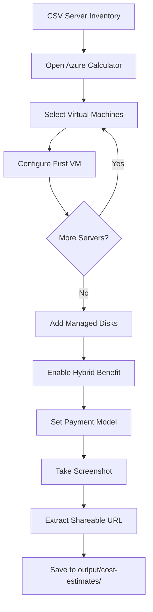

# Agent-Azure-Calculator-Generator

A VS Code custom agent (`@BoM-Infra-calculator`) that automates end-to-end Azure infrastructure migration assessments — from Excel server inventory ingestion through VM right-sizing, hub-and-spoke network design, cost estimation, and Azure Pricing Calculator automation.

## What It Does

1. **Ingests server inventory** from Excel files (single consolidated file or two-file Azure Migrate export format)
2. **Applies 6R migration strategy** (Rehost, Replatform, Refactor, Rearchitect, Rebuild, Replace)
3. **Right-sizes VMs** using D-series (general), E-series (memory/SQL), F-series (compute) — **never B-series**
4. **Designs hub-and-spoke network** with CIDR allocation, spoke segmentation, and infrastructure server placement
5. **Generates consolidated CSV** with all sizing decisions and rationale
6. **Validates output** against source data (mandatory pre-gate)
7. **Automates Azure Pricing Calculator** via Playwright for formal cost estimates
8. **Produces assessment report** with architecture diagrams and cost breakdown

## Prerequisites

| Requirement | Purpose |
|-------------|---------|
| VS Code (latest) | Host editor with GitHub Copilot |
| GitHub Copilot Chat | Agent runtime |
| Excel MCP Server | Read Excel files via COM automation (Windows) |
| Azure MCP Server | Pricing queries, SKU availability, region checks |
| Microsoft Learn MCP | Documentation validation |
| Playwright MCP Server | Azure Calculator browser automation |
| Python 3.8+ | Scripts and diagram generation |
| openpyxl | Excel parsing (`pip install openpyxl`) |
| Graphviz | Architecture diagram rendering |

### MCP Server Configuration

Add these to your VS Code `settings.json` or `.vscode/mcp.json`:

```json
{
  "mcp": {
    "servers": {
      "excel-mcp": { "command": "..." },
      "azure": { "command": "..." },
      "microsoft-lea": { "command": "..." },
      "microsoft_pla": { "command": "..." }
    }
  }
}
```

Refer to each MCP server's documentation for installation commands.

## Installation

1. Clone this repository into your workspace:
   ```bash
   git clone https://github.com/ibranibeny/Agent-Azure-Calculator-Generator.git
   ```

2. Open in VS Code:
   ```bash
   code Agent-Azure-Calculator-Generator
   ```

3. Install Python dependencies:
   ```bash
   pip install openpyxl diagrams
   ```

4. Ensure MCP servers are configured (see Prerequisites)

5. The `@BoM-Infra-calculator` agent becomes available in GitHub Copilot Chat

## Usage

### Quick Start

In VS Code Copilot Chat:
```
@BoM-Infra-calculator Migrate my servers from C:\path\to\server-inventory.xlsx
```

### With Two Files (Azure Migrate Exports)
```
@BoM-Infra-calculator Migrate using:
- Rightsizing: C:\exports\Rightsizing-Export.xlsx
- App-to-Server: C:\exports\App-to-Server-Export.xlsx
```

### Custom Options
```
@BoM-Infra-calculator Migrate C:\data\servers.xlsx to westus2 with 30% buffer
```

## 8-Turn Agent Protocol

The agent follows a structured 8-turn workflow:

| Turn | Phase | Output |
|------|-------|--------|
| 1 | Excel Ingestion | Parsed server data, column mapping |
| 2 | Data Validation | Server count, scope filter, OS detection |
| 3 | Architecture Design | Hub-spoke topology, spoke segmentation |
| 4 | VM Right-Sizing | SKU assignments with rationale |
| 5 | User Confirmation | Buffer, AHUB, payment model preferences |
| 6 | CSV Generation | Consolidated server inventory CSV |
| 7 | Calculator Automation | Azure Pricing Calculator estimate |
| 8 | Final Report | Assessment document with all findings |

## Skills (Deep Dive)

Skills are procedural knowledge files (`.github/skills/<name>/SKILL.md`) that teach the agent **how** to perform complex multi-step tasks. Unlike instructions (which provide rules), skills provide step-by-step procedures with decision trees, error handling, and validation gates.

### 1. Excel Data Ingestion (`excel-data-ingestion`)
Parses server inventory from Excel via the **Excel MCP Server** (COM automation). Handles:
- **Single-file format**: 34-column consolidated inventory (see `samples/server-inventory.xlsx`)
- **Two-file format**: Azure Migrate Rightsizing Export + App-to-Server Export
- IRM/AIP-protected workbooks (opens with `show: true` for credential prompts)
- Automatic header detection (row 1 vs row 2 vs row 6 depending on format)
- Column fuzzy-matching when headers don't exactly match expected names

### 2. Excel-to-CSV Analysis (`excel-to-csv-analysis`)
Correlates server data from multiple sheets/files and produces a unified CSV:
- Joins by server hostname (primary key)
- Enriches with OS version, SQL detection, environment, power state
- Groups servers by application/workload for spoke segmentation
- Handles multi-app servers (one server hosting multiple applications)
- Flags unclassified servers for user decision

### 3. Azure Calculator Automation (`azure-calculator-automation`)
**Automates the Azure Pricing Calculator at https://azure.microsoft.com/en-us/pricing/calculator/ using the Playwright MCP Server.** This is the flagship skill that generates formal, shareable cost estimates:

#### How It Works (Playwright MCP Flow):
```
1. browser_navigate → Open Azure Pricing Calculator URL
2. browser_click    → Select "Virtual Machines" product card
3. browser_fill_form → Configure VM: region, OS, tier, instance, payment model
4. browser_click    → Add managed disks (Premium SSD, Standard SSD, etc.)
5. browser_click    → Enable Azure Hybrid Benefit toggle (if licensed)
6. browser_click    → Set payment model (Pay-as-you-go / 1yr RI / 3yr RI)
7. Repeat steps 2-6  → For EACH server in the inventory
8. browser_snapshot → Capture final estimate summary
9. browser_take_screenshot → Save estimate as PNG for proposal docs
10. browser_evaluate → Extract total monthly/annual cost from DOM
```

#### Key Capabilities:
- **Batch processing**: Adds all servers from CSV inventory to a single Calculator estimate
- **Per-server configuration**: Each VM gets its own SKU, disks, region, and payment model
- **Hybrid Benefit**: Automatically enables AHUB for Windows Server and SQL licenses
- **Screenshots**: Captures estimate at each stage for audit trail
- **Shareable URL**: Extracts the Calculator's shareable estimate link
- **Error recovery**: Retries on page load failures, handles Calculator UI changes

#### Example Agent Interaction:
```
Turn 7: "Automating Azure Pricing Calculator..."
→ Opening browser to Calculator
→ Adding VM: WEB-PROD01 (Standard_D2as_v5, East US, Windows, 3yr RI)
→ Adding VM: SQL-PROD01 (Standard_E8as_v5, East US, Windows+SQL, 3yr RI)
→ Adding managed disks: 2× S10 (100GB each)
→ Enabling Azure Hybrid Benefit...
→ Screenshot saved: output/cost-estimates/calculator-estimate.png
→ Shareable URL: https://azure.com/e/abc123...
→ Total estimated monthly cost: $1,247.32
```

### 4. Calculator from CSV (`calculator-from-csv`)
A streamlined variant that takes a pre-generated CSV file and drives the Calculator directly:
- Reads each row from the server inventory CSV
- Maps CSV columns to Calculator form fields
- Supports batch mode (all servers in one estimate) or per-workload estimates
- Validates Calculator totals against pre-calculated CSV cost columns

### 5. Azure Cost & Availability (`azure-cost-availability`)
Queries live Azure pricing and regional SKU availability via the **Azure MCP Server**:
- Checks if a VM SKU is available in the target region
- Compares Pay-as-you-go vs 1-year vs 3-year Reserved Instance pricing
- Validates disk type availability (Premium SSD requires specific VM tiers)
- Falls back to alternative SKUs if primary choice is unavailable
- Caches pricing data to minimize API calls during batch sizing

### 6. CSV-Source Reconciliation (`csv-source-reconciliation`)
**Mandatory pre-gate** that runs BEFORE Calculator automation. Validates:
- Total server count matches source Excel
- No servers dropped during correlation
- Disk counts match (sum of all comma-separated disk entries)
- Field values spot-checked against source (cores, RAM, storage)
- OS type preserved correctly through the pipeline

### 7. Accuracy Validation (`accuracy-validation`)
Post-generation validation comparing Calculator output against source:
- Row-level comparison of CSV vs Excel source
- Cost sanity checks (no $0 costs for production servers)
- SKU family consistency (SQL servers → E-series confirmed)
- Region consistency (all servers targeting same region)
- Produces accuracy percentage and error report

### 8. Best Practice Architecture (`best-practice-architecture`)
Validates the designed architecture against Microsoft Learn best practices:
- Hub-spoke topology compliance (single hub, isolated spokes)
- Subnet sizing (minimum /26 for AzureFirewallSubnet)
- NSG placement on every subnet
- Gateway transit enabled on hub peering
- Infrastructure servers in hub SharedServices (not in spokes)
- References official docs via **Microsoft Learn MCP** for validation

---

## Azure Pricing Calculator Automation (Detailed)

This section provides a complete reference for how the agent automates Azure's Pricing Calculator using Playwright MCP.

### Prerequisites for Calculator Automation

| Requirement | Details |
|-------------|---------|
| Playwright MCP Server | Must be running and connected (`microsoft_pla` or `microsoft_pla2`) |
| Browser | Chromium-based browser available to Playwright |
| Network | Internet access to `azure.microsoft.com` |
| CSV Input | Generated server inventory with SKU, region, disk, and cost columns |

### Calculator Automation Workflow



### MCP Tools Used

| Tool | Purpose |
|------|---------|
| `browser_navigate` | Open Calculator URL |
| `browser_snapshot` | Get page DOM for element identification |
| `browser_click` | Select products, toggle switches, expand sections |
| `browser_fill_form` | Enter VM name, select dropdowns (region, OS, tier) |
| `browser_select_option` | Choose from Calculator dropdown menus |
| `browser_type` | Enter numeric values (hours, quantity) |
| `browser_take_screenshot` | Capture estimate for proposal documents |
| `browser_evaluate` | Extract cost totals from page JavaScript |
| `browser_wait_for` | Wait for Calculator to recalculate after changes |

### Output Artifacts

After Calculator automation completes, you'll find:

```
output/cost-estimates/
├── calculator-estimate.png          # Full estimate screenshot
├── calculator-per-workload/         # Per-spoke estimates (if segmented)
│   ├── spoke-erp-prod.png
│   └── spoke-middleware.png
├── estimate-url.txt                 # Shareable Calculator URL
└── cost-summary.json                # Extracted costs (monthly/annual/3yr)
```

### Error Handling

| Scenario | Agent Behavior |
|----------|----------------|
| Calculator page timeout | Retry navigation up to 3 times |
| SKU not in Calculator dropdown | Fall back to closest available SKU, note in report |
| Browser crash | Restart browser session, resume from last completed VM |
| Price discrepancy vs API | Flag in validation report, use Calculator price as authoritative |
| Rate limiting | Add delays between VM additions (2-3 seconds) |

---

## Directory Structure

```
.github/
├── agents/
│   └── BoM-Infra-calculator.agent.md    # Agent definition
├── instructions/
│   ├── vm-sizing.instructions.md         # VM SKU selection rules
│   ├── hub-spoke-design.instructions.md  # Network architecture
│   ├── excel-correlation.instructions.md # Two-file join logic
│   ├── diagram-generation.instructions.md# Python Diagrams conventions
│   └── output-metadata.instructions.md  # Output file headers
├── skills/
│   ├── excel-data-ingestion/SKILL.md     # Excel parsing procedures
│   ├── excel-to-csv-analysis/SKILL.md    # CSV generation
│   ├── azure-calculator-automation/SKILL.md # Calculator via Playwright
│   ├── calculator-from-csv/SKILL.md      # Calculator from CSV
│   ├── azure-cost-availability/SKILL.md  # Pricing/SKU checks
│   ├── accuracy-validation/SKILL.md      # Output validation
│   ├── csv-source-reconciliation/SKILL.md# Mandatory pre-gate
│   └── best-practice-architecture/SKILL.md # Architecture validation
├── prompts/
│   ├── migrate-servers.prompt.md         # Full migration workflow
│   ├── generate-cost-estimate.prompt.md  # Calculator automation
│   └── validate-output.prompt.md         # Output validation
└── copilot-instructions.md               # Project-level instructions
scripts/
├── vm_sizing.py                          # VM right-sizing logic
└── enrich_csv.py                         # CSV enrichment from Excel
samples/
├── server-inventory.xlsx                 # Sample Excel input (5 servers)
└── excel-format-guide.md                 # Excel input format documentation
output/                                   # Generated outputs (gitignored)
├── migration-plan/                       # CSV and assessment reports
├── architecture/                         # Diagrams and scripts
└── cost-estimates/                       # Calculator screenshots/URLs
```

## Excel Input Format

### Single File (Recommended for New Projects)

A single `.xlsx` with 20 columns. Key columns:

| Column | Purpose |
|--------|---------|
| Server | Hostname (primary key) |
| Server Category | Windows / Linux / SQL |
| Scope | In Scope / Out of Scope |
| Current Cores | Allocated vCPUs |
| Current CPU Usage (%) | Average utilization |
| Current RAM (MB) | Allocated memory |
| Current Memory Usage (%) | Memory utilization |
| Storage (GB) | Total storage |
| disks type | Comma-separated disk types (S10, S20, etc.) |
| disk capacity (GB) | Comma-separated disk sizes |

See [samples/excel-format-guide.md](samples/excel-format-guide.md) for complete column reference.

### Two Files (Azure Migrate Exports)

- **Rightsizing Export** — Server specs, utilization, disk IOPS
- **App-to-Server Export** — OS version, SQL detection, environment

Files are correlated by server hostname.

## VM Sizing Rules

| Priority | Signal | VM Family |
|----------|--------|-----------|
| 1 | SQL Server detected | E-series (memory-optimized) |
| 2 | Memory-heavy utilization | E-series |
| 3 | CPU-heavy utilization | F-series (compute-optimized) |
| 4 | Default/balanced | D-series (general-purpose) |

- **Buffer**: 20% added to utilization-based sizing (configurable)
- **Minimum**: 2 vCPUs for all VMs
- **NEVER**: B-series (burstable) — unpredictable performance during migration
- **Excluded**: Windows Server < 2016 (2003, 2008, 2012)

## Network Architecture

Hub-and-spoke topology with:
- **Hub VNet** (10.0.0.0/16): Azure Firewall, VPN Gateway, SharedServices subnet
- **Spoke VNets** (10.x.0.0/16): One per workload group with web/app/data subnets
- **Peering**: All spokes peer to hub; inter-spoke traffic routes through firewall
- **Infrastructure servers**: Detected and placed in hub SharedServices subnet

## Customization

### Adding New VM Families

Edit `.github/instructions/vm-sizing.instructions.md` to add new family selection rules.

### Changing Network Design

Edit `.github/instructions/hub-spoke-design.instructions.md` for CIDR ranges, subnet allocation, or spoke segmentation options.

### Adding Skills

Create a new directory under `.github/skills/<skill-name>/SKILL.md` with procedural instructions the agent should follow.

## Troubleshooting

| Issue | Solution |
|-------|----------|
| Excel MCP can't open file | Close file in Excel desktop app (COM needs exclusive access) |
| IRM-protected Excel | Use `show: true` parameter in Excel MCP file open |
| Calculator automation fails | Ensure Playwright MCP is connected and browser is available |
| Zero utilization data | Agent falls back to allocated capacity (documented in output) |
| Missing OS column | Agent uses fuzzy column matching; check header spelling |

## License

MIT
