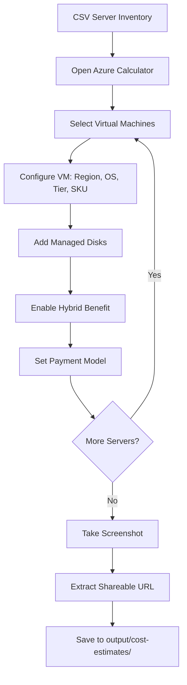

# Azure Pricing Calculator Automation
{: .fs-8 }

The agent automates the [Azure Pricing Calculator](https://azure.microsoft.com/en-us/pricing/calculator/) using **Playwright MCP Server** to generate formal, shareable cost estimates without any manual data entry.
{: .fs-5 .fw-300 }

---

## How It Works



---

## Playwright MCP Flow (Step by Step)

| Step | MCP Tool | Action |
|------|----------|--------|
| 1 | `browser_navigate` | Open Azure Pricing Calculator URL |
| 2 | `browser_click` | Select "Virtual Machines" product card |
| 3 | `browser_fill_form` | Configure VM: region, OS, tier, instance |
| 4 | `browser_click` | Add managed disks (Premium SSD, Standard SSD, etc.) |
| 5 | `browser_click` | Enable Azure Hybrid Benefit toggle (if licensed) |
| 6 | `browser_click` | Set payment model (Pay-as-you-go / 1yr RI / 3yr RI) |
| 7 | _Repeat 2–6_ | For EACH server in the inventory |
| 8 | `browser_snapshot` | Capture final estimate summary |
| 9 | `browser_take_screenshot` | Save estimate as PNG for proposal docs |
| 10 | `browser_evaluate` | Extract total monthly/annual cost from DOM |

---

## Prerequisites

| Requirement | Details |
|-------------|---------|
| Playwright MCP Server | Must be running and connected (`microsoft_pla` or `microsoft_pla2`) |
| Browser | Chromium-based browser available to Playwright |
| Network | Internet access to `azure.microsoft.com` |
| CSV Input | Generated server inventory with SKU, region, disk, and cost columns |

---

## MCP Tools Reference

| Tool | Purpose |
|------|---------|
| `browser_navigate` | Open Calculator URL |
| `browser_snapshot` | Get page DOM for element identification |
| `browser_click` | Select products, toggle switches, expand sections |
| `browser_fill_form` | Enter VM name, select dropdowns (region, OS, tier) |
| `browser_select_option` | Choose from Calculator dropdown menus |
| `browser_type` | Enter numeric values (hours, quantity) |
| `browser_take_screenshot` | Capture estimate for proposal documents |
| `browser_evaluate` | Extract cost totals from page JavaScript |
| `browser_wait_for` | Wait for Calculator to recalculate after changes |

---

## Example Agent Interaction

```
Turn 7: "Automating Azure Pricing Calculator..."
→ Opening browser to Calculator
→ Adding VM: WEB-PROD01 (Standard_D2as_v5, East US, Windows, 3yr RI)
→ Adding VM: SQL-PROD01 (Standard_E8as_v5, East US, Windows+SQL, 3yr RI)
→ Adding managed disks: 2× S10 (100GB each)
→ Enabling Azure Hybrid Benefit...
→ Screenshot saved: output/cost-estimates/calculator-estimate.png
→ Shareable URL: https://azure.com/e/abc123...
→ Total estimated monthly cost: $1,247.32
```

---

## Output Artifacts

After Calculator automation completes:

```
output/cost-estimates/
├── calculator-estimate.png          # Full estimate screenshot
├── calculator-per-workload/         # Per-spoke estimates (if segmented)
│   ├── spoke-erp-prod.png
│   └── spoke-middleware.png
├── estimate-url.txt                 # Shareable Calculator URL
└── cost-summary.json                # Extracted costs (monthly/annual/3yr)
```

---

## Error Handling

| Scenario | Agent Behavior |
|----------|----------------|
| Calculator page timeout | Retry navigation up to 3 times |
| SKU not in dropdown | Fall back to closest available SKU, note in report |
| Browser crash | Restart browser session, resume from last completed VM |
| Price discrepancy vs API | Flag in validation report, use Calculator price as authoritative |
| Rate limiting | Add delays between VM additions (2–3 seconds) |

---

## Payment Models Supported

| Model | Use Case | Savings |
|-------|----------|---------|
| Pay-as-you-go | Dev/Test, short-term | Baseline |
| 1-year Reserved | Stable production workloads | ~30-40% |
| 3-year Reserved | Long-term committed workloads | ~50-60% |

{: .tip }
> The agent asks which payment model to use at **Turn 5** (User Confirmation). Default is 3-year Reserved for production, Pay-as-you-go for Dev/Test.

---

## Azure Hybrid Benefit

The agent automatically enables AHUB when:
- Server is running **Windows Server** (2016+)
- Server has **SQL Server** detected (`sql_detected = Yes`)
- User confirms they have qualifying Software Assurance licenses

AHUB savings: ~40% for Windows Server, ~55% for SQL Server.
