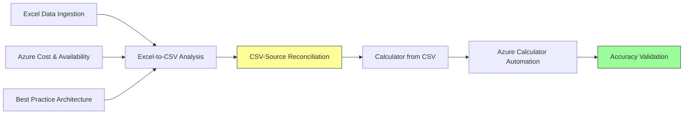

# Skills
{: .fs-8 }

Skills are procedural knowledge files (`.github/skills/<name>/SKILL.md`) that teach the agent **how** to perform complex multi-step tasks. Unlike instructions (which set rules), skills provide step-by-step procedures with decision trees, error handling, and validation gates.
{: .fs-5 .fw-300 }

---

## 1. Excel Data Ingestion

**File**: `.github/skills/excel-data-ingestion/SKILL.md`

Parses server inventory from Excel via the **Excel MCP Server** (COM automation).

| Capability | Details |
|-----------|---------|
| Single-file format | 34-column consolidated inventory |
| Two-file format | Azure Migrate Rightsizing + App-to-Server Export |
| IRM/AIP protected | Opens with `show: true` for credential prompts |
| Header detection | Automatically finds headers at row 1, 2, or 6 |
| Column matching | Fuzzy-matches headers when names don't match exactly |

---

## 2. Excel-to-CSV Analysis

**File**: `.github/skills/excel-to-csv-analysis/SKILL.md`

Correlates server data from multiple sheets/files and produces a unified CSV.

- Joins by server hostname (primary key)
- Enriches with OS version, SQL detection, environment, power state
- Groups servers by application/workload for spoke segmentation
- Handles multi-app servers (one server hosting multiple applications)
- Flags unclassified servers for user decision

---

## 3. Azure Calculator Automation

**File**: `.github/skills/azure-calculator-automation/SKILL.md`

{: .note }
> This is the **flagship skill** — it automates the Azure Pricing Calculator via Playwright MCP to generate formal, shareable cost estimates.

See the dedicated [Calculator Automation]({{ site.baseurl }}) page for full details.

**Key capabilities:**
- Batch processing: All servers in one Calculator estimate
- Per-server configuration: SKU, disks, region, payment model
- Azure Hybrid Benefit: Auto-enables for Windows/SQL licenses
- Screenshots: Captures estimate at each stage for audit trail
- Shareable URL: Extracts Calculator's shareable estimate link
- Error recovery: Retries on page failures, handles UI changes

---

## 4. Calculator from CSV

**File**: `.github/skills/calculator-from-csv/SKILL.md`

A streamlined variant that drives the Calculator directly from a pre-generated CSV:

- Reads each row from the server inventory CSV
- Maps CSV columns to Calculator form fields
- Supports batch mode (all servers) or per-workload estimates
- Validates Calculator totals against pre-calculated CSV cost columns

---

## 5. Azure Cost & Availability

**File**: `.github/skills/azure-cost-availability/SKILL.md`

Queries live Azure pricing and regional SKU availability via the **Azure MCP Server**:

- Checks if a VM SKU is available in the target region
- Compares Pay-as-you-go vs 1-year vs 3-year Reserved pricing
- Validates disk type availability (Premium SSD requires specific VM tiers)
- Falls back to alternative SKUs if primary choice unavailable
- Caches pricing data to minimize API calls

---

## 6. CSV-Source Reconciliation

**File**: `.github/skills/csv-source-reconciliation/SKILL.md`

{: .important }
> **Mandatory pre-gate** — runs BEFORE Calculator automation. If this fails, the workflow halts.

Validates:
- Total server count matches source Excel
- No servers dropped during correlation
- Disk counts match (sum of all comma-separated entries)
- Field values spot-checked against source (cores, RAM, storage)
- OS type preserved correctly through the pipeline

---

## 7. Accuracy Validation

**File**: `.github/skills/accuracy-validation/SKILL.md`

Post-generation validation comparing Calculator output against source:

- Row-level comparison of CSV vs Excel source
- Cost sanity checks (no $0 costs for production servers)
- SKU family consistency (SQL servers → E-series confirmed)
- Region consistency (all servers targeting same region)
- Produces accuracy percentage and error report

---

## 8. Best Practice Architecture

**File**: `.github/skills/best-practice-architecture/SKILL.md`

Validates the designed architecture against Microsoft Learn best practices:

- Hub-spoke topology compliance (single hub, isolated spokes)
- Subnet sizing (minimum /26 for AzureFirewallSubnet)
- NSG placement on every subnet
- Gateway transit enabled on hub peering
- Infrastructure servers in hub SharedServices (not in spokes)
- References official docs via **Microsoft Learn MCP**

---

## How Skills Interact

{: .tip }
> Yellow = mandatory gate | Green = final validation
